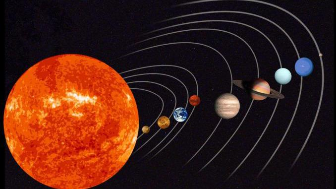
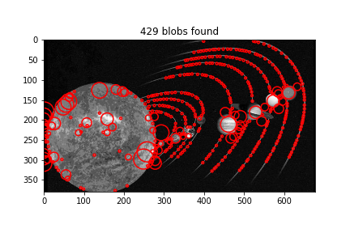
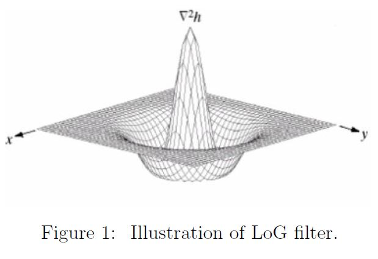
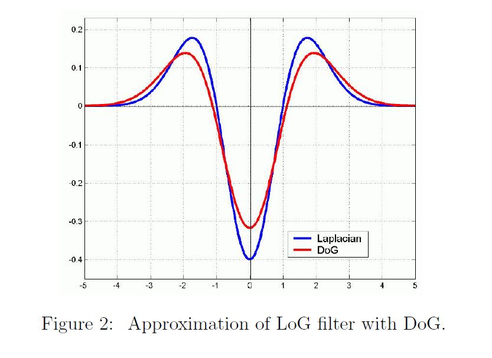
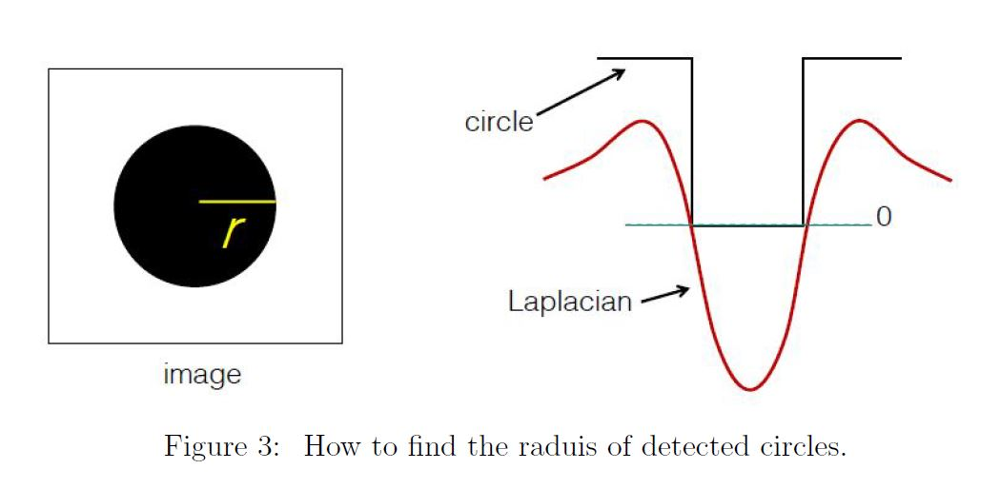
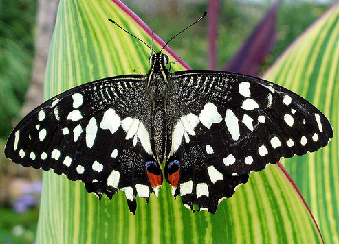
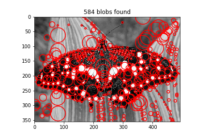

# Blob Detector

- Implemented using core Python, No Image Processing Packages!
- 2D convolution code is implemented.
- Laplacian of Gaussian (LoG) filter implemented.
- Difference of Gaussian (DoG) filter implemented a faster approximate for LoG.

## Requirements and Dependencies
```bash
numpy==1.15.4
matplotlib==3.0.2
Pillow==8.1.2
```


# Main Function: `blob_detector`

Here is the main function and a sample running command and output. The details are provided in the following sections.

`blob_detector(File_name, sigma, n, threshold, Filter, output name)`

Input Arguments:

- `File_name`:name of the input image (e.g. 'butter y.jpg')
- `sigma`: σ value (the initial scale value, e.g. 2)
- `n`: number of scales to iterate over and levels in scale pyramid (e.g 10)
- `threshold`: the threshold for blob detection (e.g. 0.01)
- `Filter`: 'LOG' or 'DOG' filter
- `output_name`: name to save the resulting output of blob detection (e.g. 'blob out')

Output:

- An image with circles of blobs detected with proper scale drawn on it.
- Here is a sample output for `σ=2, threshold=0.0, n=10, Filter= 'DoG'`


`blob_detector('solar.jpg', 2, 10, 0.01, 'DOG', 'buttefly blob')`

 


## Instructions

The main code is `afallah_blob.py` under the `source` folder. Make sure that it has access to input images and the the `Conv_2D.py` and `Resize.py` codes.


## Introduction

Blob detector consists of several ports. In order to detect blobs, we need to generate a Laplacian of Gaussian (LoG) filter with proper dimensions. We can also use the Difference of Gaussian (DoG) filter that approximate the LoG filter and has lower computational cost. The details of LoG and DoG implementations are discussed later. The next step in blob detection is creating a Laplacian scale-space. Starting from an initial scale for n iterations, we should filter the image with scale-normalized LoG (or DoG). Then we should save the squared Laplacian response for the current scale, increase the scale by some fixed value (e.g. k), and repeat until end of iteration. When the scale-space is completed it is time to perform non-maximum suppression on it. Since the detector might detect the same object multiple times, non-maximum suppression is used to make sure that the object is detected only once. After that, we need to find the coordinates of the center of blobs (circles) and their radius in order to be able to display them on the input image. The responses should be compared with a threshold and the ones that are greater than the threshold will be selected as center of circles. The radius of circles is calculated based on the scale of the detection. Multiple functions have been developed to implement the above described processes. The code is written in Python 3 and the functions and steps are discussed in the following sections.


## Laplacian of Gaussian (LoG) filter

The first method is to implement the LoG filter exactly based on the following equation.
$$
\mbox{LoG} = -\frac{1}{\pi \sigma^4}(1-\frac{x^2 + y^2}{2 \sigma^2})\exp(-\frac{x^2 + y^2}{2 \sigma^2})
$$
The LoG filter is implemented by the `LoG_filter(sigma)` function in the main code (`afallahblob.py`).  This code will return a LoG filter with proper dimensions scaled with σ2.  This method will generate a more accurate result bus has more computation complexity compared to the approximation that is described next.  The LoG filter is illustrated below.




## Difference of Gaussian (DoG) filter

This method will approximate the LoG filter with parameter σ with difference of two Gaussian functions with variances equal to 1.6σ and σ respectively. 
$$
     G_{\sigma} = \frac{1}{2 \pi \sigma^2}\exp{-\frac{x^2 + y^2}{2 \sigma^2}}
$$

$$
    \mbox{LoG} \approx G_{1.6\sigma}-G_{\sigma}
$$

This filter is implemented via `Dog_filter(sigma)` function in the main code (`afallahblob.py`). Figure 2 indicates the approximation of LoG filter with DoG filter.



## 2D Convolution

In order to make the implementation more efficient, we will keep the size of the filtered and reduce the size of input image by down-sampling. In order to avoid aliasing effects in down-sampling the image, a Gaussian blurring filter is applied to the image to remove the high frequency components before down-sampling. The `conv2d` function in this python code will do the convolution using `copyedge` padding and `same` output size. This means that the input image will be padded by the edge values around its borders to implement the convolution and the resulting output will have the same dimensions as the input image. `conv2d(image, kernel, 'same', 'copyedge')`
The kernel used in this command is going to be either `LoG` filter or `DoG` filter.


## Scale Space Creation

The next step of implementing blob detector is to create the scale-space of the input image. In order to do that we need two more functions naming `Resize` and `max_replace2`. The `Resize` function uses bilinear interpolation to change the size of the given image into desired output dimensions (either smaller or larger). This function is used twice in creating the scale-space. First to down-sample the image, and then two up-sample it after applying the scaled LoG (or DoG) filter.

`Resize(image, [out row, out col])`

The `image` indicates the input image and [out row, out col] indicate the desired output dimensions.
The `max_replace2` function does the non-maximum suppression job. Given size of a neighborhood it will replace the elements of that neighborhood by the maximum value of it.

`max_replace2(array, n)`

where `array` is the input image and `n` is the size of neighborhood for non-maximum suppression.
Using above described functions we can form the the following function that creates the scale-space:

`scale_space_create(image, sigma, n, Filter)`

where `image` is the input image, `sigma` is the initial scale value, `n` is the number of scales to be created, and `Filter` is the type of filter to be applied at each scale (either 'LOG' or 'DOG'). The above function will first create the LoG (or DoG) filter based on its input argument by calling the proper function. Then, it will down-sample the image based on the iteration number (from 1 to n) using the `Resize` function. Then the scaled (by σ2) LoG (or DoG) filterwill be applied on the on the down-sampled image using `conv2d` function. After that, the resulting array will be squared and then up-sampled to its original value using the `Resize` function again. The result will be recorded in the scale-space tensor (three-dimensional matrix). Then, the non-max suppression will be implemented for each scale using the `max_replace2` function, and the results will be recorded in another tensor. Finally the image is convoluted with a Gaussian blurring filter before down-sampling for the next scale, in order to prevent aliasing.


## Blob Detection

Next, we need to find the maximum response scale. In order to do this the function `find_scale` is defined.

`find_scale(org row, org col, Scale Space)`

The above function gets the dimensions of the original input image and the result of the `scale_space_create` function as input. This function will find the scale that has the maximum response to the LoG (or DoG) filter in the scale-space created previously. The result is recorded in a tensor called `max_scale`.
Having these information, we can now start to find the circles. The `find_circles` functions is defined to do this task.

`find_circles(max scale, threshold, sigma)`

This function gets the result of previous function ( find scale) and the values of threshold and σ as the input and returns the coordinates of the center of the circles. It also calculates the radius of each circle based on the values of scale and σ using the following formula:
$$
r = \sqrt2 \sigma
$$


Finally, we need a function to depict the results and draw the circles of detected blobs with proper radius and center on the original input image. The `draw_circles` function is developed to handle this task.

`draw_circles(image, output name, cx, cy, rad, color='r')`

This function takes the original image, the desired name to save the output under it, the coordinates of center of circles as well as their radius, and the color of the circles as input. It will iterate over the center of circles and draw them according to the proper radius. The resulting image will be saved under the given name.


## Final Function: `blob_detector`

The final piece of the puzzle that puts all the above functions to work is the blob detector function. This function calls the above described functions in the required order and gives the output of each of them to the input of the next one so that the desired result will be produced as output of the blob detector.

`blob_detector(File_name, sigma, n, threshold, Filter, output name)`

Input Arguments:

- `File_name`:name of the input image (e.g. 'butter y.jpg')
- `sigma`: σ value (the initial scale value, e.g. 2)
- `n`: number of scales to iterate over and levels in scale pyramid (e.g 10)
- `threshold`: the threshold for blob detection (e.g. 0.01)
- `Filter`: 'LOG' or 'DOG' filter
- `output_name`: name to save the resulting output of blob detection (e.g. 'blob out')

Output:

- An image with circles of blobs detected with proper scale drawn on it.
- Here is a sample output for `σ=2, threshold=0.0, n=10, Filter= 'DoG'`

 


## Results
For experiment details and results see Results.pdf


